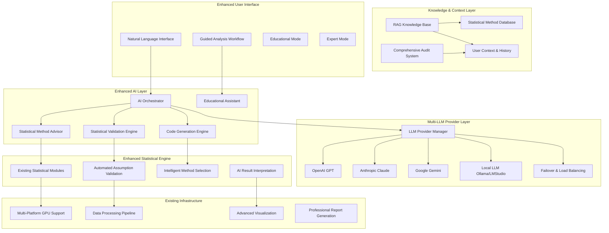
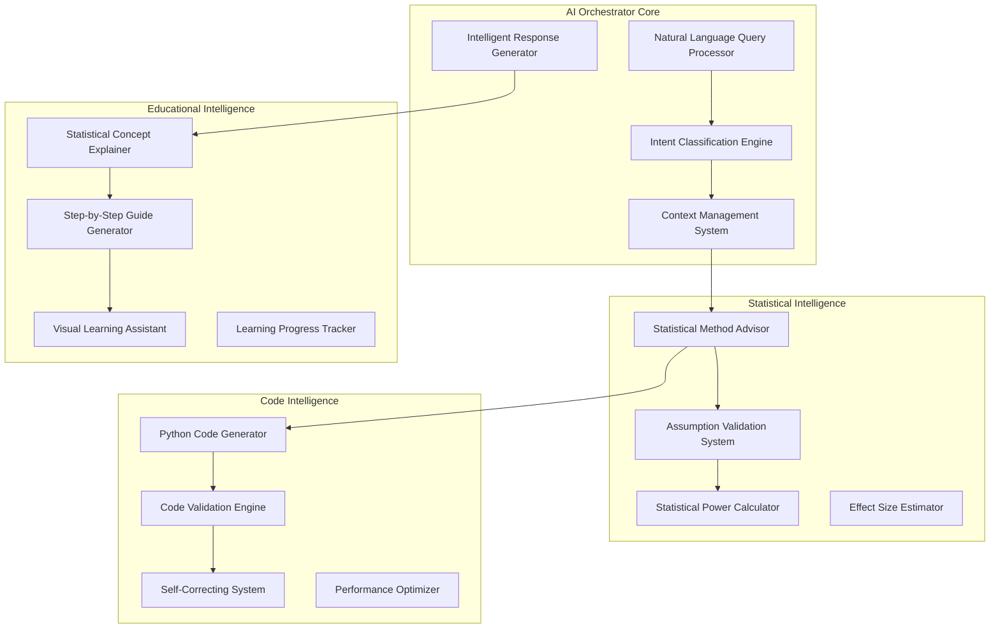

# Design Document

## Overview

The AI-driven statistics enhancement builds upon the existing Professional Statistics Suite to create a comprehensive, intelligent statistical analysis platform. The design leverages the current multi-platform GPU support (CUDA/MPS/ROCm), existing AI integration capabilities, and professional-grade architecture while adding advanced AI-driven features for intelligent statistical guidance, automated analysis workflows, and enhanced user experience.

The system architecture follows a modular design with clear separation between the AI intelligence layer, statistical computation engine, and user interface components. This enhancement maintains backward compatibility while introducing cutting-edge AI capabilities that make advanced statistical analysis accessible to users of all skill levels.

## Architecture

### High-Level System Architecture



### AI Intelligence Layer Architecture

The AI intelligence layer serves as the brain of the enhanced system, coordinating between user intent, statistical knowledge, and computational resources.



## Components and Interfaces

### 1. AI Orchestrator Component

**Purpose**: Central coordination hub for all AI-driven functionality

**Key Classes**:
- `AIOrchestrator`: Main coordination class
- `QueryProcessor`: Natural language processing
- `IntentClassifier`: User intent recognition
- `ContextManager`: Session and analysis context management

**Interfaces**:
```python
class AIOrchestrator:
    async def process_user_query(self, query: str, context: AnalysisContext) -> AIResponse
    async def suggest_statistical_methods(self, data_info: DataInfo) -> List[MethodSuggestion]
    async def validate_analysis_approach(self, method: str, data: pd.DataFrame) -> ValidationResult
    async def generate_educational_content(self, concept: str, user_level: str) -> EducationalContent
```

### 2. Enhanced Statistical Method Advisor

**Purpose**: Intelligent statistical method selection and validation

**Key Classes**:
- `StatisticalMethodAdvisor`: Core advisory system
- `AssumptionValidator`: Automated assumption checking
- `MethodCompatibilityChecker`: Method-data compatibility assessment
- `PowerAnalysisEngine`: Statistical power calculations

**Interfaces**:
```python
class StatisticalMethodAdvisor:
    def analyze_data_characteristics(self, data: pd.DataFrame) -> DataCharacteristics
    def suggest_methods(self, data_chars: DataCharacteristics, research_question: str) -> List[MethodSuggestion]
    def validate_method_assumptions(self, method: str, data: pd.DataFrame) -> AssumptionValidationResult
    def calculate_required_sample_size(self, method: str, effect_size: float, power: float) -> int
```

### 3. Multi-LLM Provider Manager

**Purpose**: Robust multi-provider LLM management with failover and optimization

**Key Classes**:
- `LLMProviderManager`: Central provider coordination
- `ProviderHealthMonitor`: Health checking and monitoring
- `CostOptimizer`: Token usage and cost optimization
- `FailoverManager`: Automatic failover handling

**Interfaces**:
```python
class LLMProviderManager:
    async def route_request(self, request: LLMRequest) -> LLMResponse
    def get_optimal_provider(self, task_type: str, data_sensitivity: str) -> str
    async def execute_with_fallback(self, request: LLMRequest) -> LLMResponse
    def get_provider_health_status(self) -> Dict[str, ProviderHealth]
```

### 4. RAG Knowledge System

**Purpose**: Contextual statistical knowledge retrieval and management

**Key Classes**:
- `StatisticalKnowledgeBase`: Core knowledge repository
- `ContextualRetriever`: Context-aware information retrieval
- `KnowledgeUpdater`: Dynamic knowledge base updates
- `SemanticSearchEngine`: Advanced semantic search capabilities

**Interfaces**:
```python
class StatisticalKnowledgeBase:
    def search_relevant_methods(self, query: str, context: AnalysisContext) -> List[KnowledgeItem]
    def get_method_documentation(self, method: str) -> MethodDocumentation
    def update_knowledge_from_analysis(self, analysis_result: AnalysisResult) -> None
    def get_educational_content(self, concept: str, difficulty_level: str) -> EducationalContent
```

### 5. Enhanced User Interface Components

**Purpose**: Intelligent, adaptive user interfaces for different user types

**Key Classes**:
- `NaturalLanguageInterface`: Conversational analysis interface
- `GuidedWorkflowManager`: Step-by-step analysis guidance
- `EducationalModeInterface`: Learning-focused interface
- `ExpertModeInterface`: Advanced user interface

**Interfaces**:
```python
class NaturalLanguageInterface:
    async def process_natural_query(self, query: str) -> AnalysisResponse
    def provide_clarifying_questions(self, ambiguous_query: str) -> List[str]
    async def explain_results(self, results: AnalysisResult, user_level: str) -> Explanation
    def suggest_follow_up_analyses(self, current_analysis: AnalysisResult) -> List[FollowUpSuggestion]
```

### 6. Comprehensive Audit and Compliance System

**Purpose**: Complete audit trail and compliance management

**Key Classes**:
- `AuditTrailManager`: Comprehensive logging system
- `ComplianceChecker`: Regulatory compliance validation
- `DataPrivacyManager`: Privacy controls and data handling
- `ReportGenerator`: Audit report generation

**Interfaces**:
```python
class AuditTrailManager:
    def log_analysis_operation(self, operation: AnalysisOperation, user: User) -> None
    def log_data_access(self, data_access: DataAccess, user: User) -> None
    def generate_audit_report(self, time_range: TimeRange, user: Optional[User]) -> AuditReport
    def check_compliance_violations(self) -> List[ComplianceViolation]
```

## Data Models

### Core Data Models

```python
@dataclass
class AnalysisContext:
    user_id: str
    session_id: str
    data_fingerprint: str
    analysis_history: List[AnalysisStep]
    user_expertise_level: str
    privacy_settings: PrivacySettings
    timestamp: datetime

@dataclass
class MethodSuggestion:
    method_name: str
    confidence_score: float
    rationale: str
    assumptions: List[str]
    prerequisites: List[str]
    estimated_computation_time: float
    educational_content: Optional[str]

@dataclass
class ValidationResult:
    is_valid: bool
    warnings: List[ValidationWarning]
    recommendations: List[str]
    assumption_violations: List[AssumptionViolation]
    suggested_alternatives: List[MethodSuggestion]

@dataclass
class AIResponse:
    content: str
    confidence: float
    provider_used: str
    tokens_consumed: int
    processing_time: float
    educational_content: Optional[EducationalContent]
    follow_up_suggestions: List[str]

@dataclass
class EducationalContent:
    concept: str
    explanation: str
    difficulty_level: str
    visual_aids: List[str]
    interactive_examples: List[str]
    further_reading: List[str]
```

### Statistical Analysis Models

```python
@dataclass
class DataCharacteristics:
    n_rows: int
    n_columns: int
    column_types: Dict[str, str]
    missing_data_pattern: Dict[str, float]
    distribution_characteristics: Dict[str, DistributionInfo]
    correlation_structure: np.ndarray
    outlier_information: OutlierInfo
    data_quality_score: float

@dataclass
class AssumptionValidationResult:
    method: str
    assumptions_met: Dict[str, bool]
    violation_severity: Dict[str, str]
    corrective_actions: List[str]
    alternative_methods: List[str]
    confidence_in_results: float

@dataclass
class AnalysisResult:
    method_used: str
    results: Dict[str, Any]
    interpretation: str
    statistical_significance: Dict[str, float]
    effect_sizes: Dict[str, float]
    confidence_intervals: Dict[str, Tuple[float, float]]
    assumptions_validation: AssumptionValidationResult
    quality_assessment: QualityAssessment
```

### User and Session Models

```python
@dataclass
class User:
    user_id: str
    expertise_level: str  # 'novice', 'intermediate', 'expert'
    preferred_explanation_style: str
    analysis_history: List[str]
    learning_progress: Dict[str, float]
    privacy_preferences: PrivacySettings

@dataclass
class AnalysisSession:
    session_id: str
    user_id: str
    start_time: datetime
    data_loaded: Optional[str]
    analyses_performed: List[AnalysisStep]
    ai_interactions: List[AIInteraction]
    educational_content_accessed: List[str]
```

## Error Handling

### Comprehensive Error Management Strategy

The enhanced system implements a multi-layered error handling approach:

#### 1. AI Provider Error Handling
```python
class AIProviderErrorHandler:
    async def handle_provider_failure(self, provider: str, error: Exception) -> AIResponse:
        # Log the failure
        self.audit_logger.log_provider_failure(provider, error)
        
        # Attempt failover to alternative provider
        alternative_providers = self.get_alternative_providers(provider)
        
        for alt_provider in alternative_providers:
            try:
                return await self.retry_with_provider(alt_provider)
            except Exception as e:
                continue
        
        # If all providers fail, provide graceful degradation
        return self.provide_fallback_response()
```

#### 2. Statistical Analysis Error Handling
```python
class StatisticalAnalysisErrorHandler:
    def handle_assumption_violations(self, violations: List[AssumptionViolation]) -> AnalysisResponse:
        response = AnalysisResponse()
        
        for violation in violations:
            if violation.severity == 'critical':
                response.add_error(f"Critical assumption violation: {violation.description}")
                response.suggest_alternative_methods(violation.alternative_methods)
            elif violation.severity == 'warning':
                response.add_warning(f"Assumption concern: {violation.description}")
                response.suggest_robustness_checks(violation.robustness_checks)
        
        return response
```

#### 3. Data Quality Error Handling
```python
class DataQualityErrorHandler:
    def handle_data_quality_issues(self, data: pd.DataFrame) -> DataQualityReport:
        issues = []
        
        # Check for missing data
        missing_data = self.check_missing_data(data)
        if missing_data.severity > 0.1:  # More than 10% missing
            issues.append(DataQualityIssue(
                type='missing_data',
                severity=missing_data.severity,
                recommendation='Consider imputation or listwise deletion'
            ))
        
        # Check for outliers
        outliers = self.detect_outliers(data)
        if len(outliers) > 0:
            issues.append(DataQualityIssue(
                type='outliers',
                count=len(outliers),
                recommendation='Review outliers and consider robust methods'
            ))
        
        return DataQualityReport(issues=issues)
```

## Testing Strategy

### Multi-Level Testing Approach

#### 1. Unit Testing
- **AI Component Testing**: Mock LLM providers for consistent testing
- **Statistical Method Testing**: Validate against known statistical datasets
- **Data Processing Testing**: Test with various data formats and edge cases

#### 2. Integration Testing
- **AI-Statistics Integration**: Test AI recommendations with actual statistical computations
- **Multi-Provider Testing**: Test failover mechanisms and provider switching
- **End-to-End Workflow Testing**: Complete analysis workflows from query to results

#### 3. Performance Testing
- **GPU Acceleration Testing**: Validate performance improvements across platforms
- **Large Dataset Testing**: Test with datasets of varying sizes (1K to 10M+ rows)
- **Concurrent User Testing**: Multi-user session handling

#### 4. Educational Content Testing
- **Learning Effectiveness Testing**: Validate educational content with different user levels
- **Explanation Quality Testing**: Test AI-generated explanations for accuracy and clarity
- **Progressive Learning Testing**: Validate learning path effectiveness

#### 5. Security and Compliance Testing
- **Data Privacy Testing**: Validate privacy controls and data handling
- **Audit Trail Testing**: Ensure complete and accurate logging
- **Access Control Testing**: Test user permissions and data access controls

### Testing Framework Implementation

```python
class AIStatisticsTestSuite:
    def setUp(self):
        self.mock_llm_provider = MockLLMProvider()
        self.test_datasets = self.load_test_datasets()
        self.ai_orchestrator = AIOrchestrator(provider=self.mock_llm_provider)
    
    async def test_method_suggestion_accuracy(self):
        """Test AI method suggestions against expert recommendations"""
        for dataset in self.test_datasets:
            suggestions = await self.ai_orchestrator.suggest_statistical_methods(dataset.info)
            expert_recommendations = dataset.expert_recommendations
            
            accuracy = self.calculate_suggestion_accuracy(suggestions, expert_recommendations)
            self.assertGreater(accuracy, 0.8)  # 80% accuracy threshold
    
    def test_assumption_validation(self):
        """Test automated assumption checking"""
        for method, dataset in self.method_dataset_pairs:
            validation_result = self.ai_orchestrator.validate_method_assumptions(method, dataset.data)
            expected_violations = dataset.known_assumption_violations
            
            self.assertEqual(
                set(validation_result.violations.keys()),
                set(expected_violations.keys())
            )
    
    def test_educational_content_generation(self):
        """Test educational content quality and appropriateness"""
        concepts = ['t-test', 'ANOVA', 'regression', 'chi-square']
        levels = ['novice', 'intermediate', 'expert']
        
        for concept in concepts:
            for level in levels:
                content = self.ai_orchestrator.generate_educational_content(concept, level)
                
                self.assertIsNotNone(content.explanation)
                self.assertEqual(content.difficulty_level, level)
                self.assertGreater(len(content.visual_aids), 0)
```

This comprehensive design provides a robust foundation for implementing the AI-driven statistics enhancement while maintaining the existing system's strengths and ensuring scalability, reliability, and user-friendliness across all skill levels.