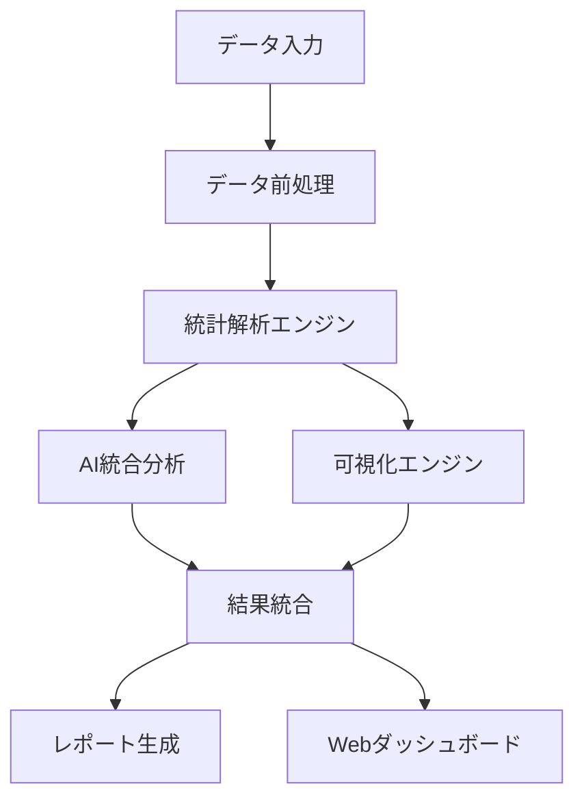
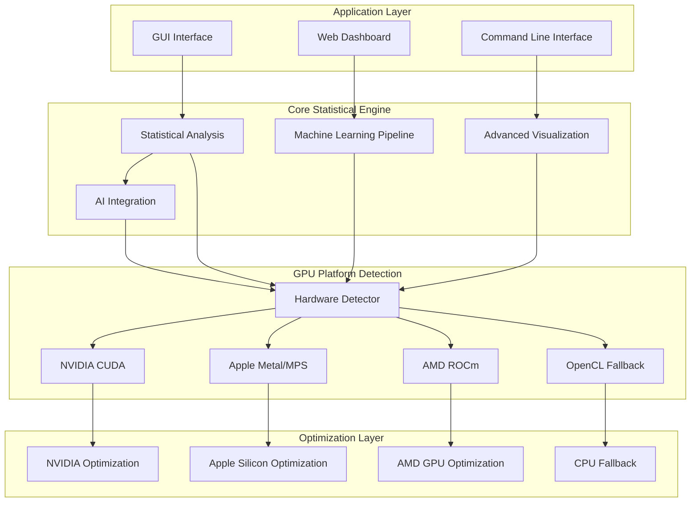
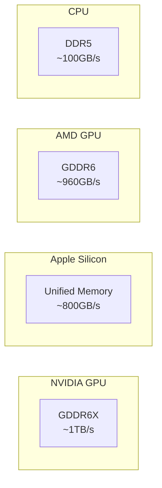
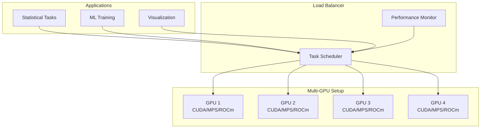
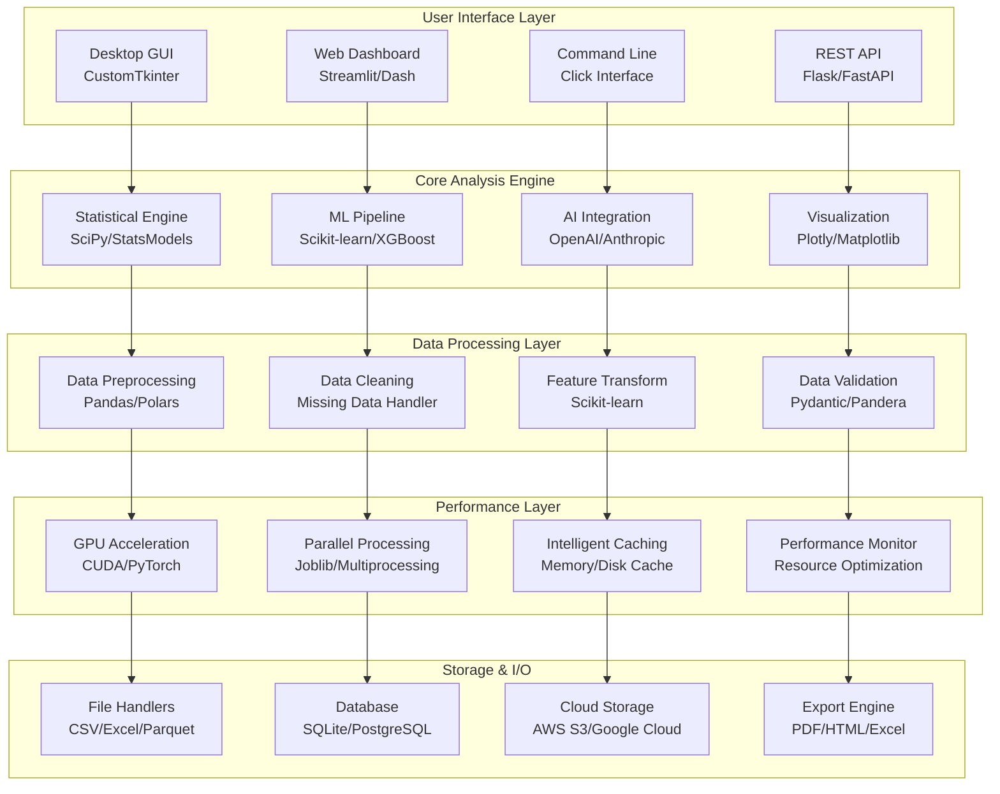

# Professional Statistics Suite - Architecture

## 📋 プロジェクト概要

Professional Statistics Suiteは、企業グレードの統計解析プラットフォームです。SPSSを超える高度な統計機能、AI統合、GPU加速を提供します。

## 🏗️ アーキテクチャ構成

### Core Modules (コアモジュール)

```
professional-statistics-suite/
├── 📊 Core Statistical Modules
│   ├── main.py                     # メインアプリケーション
│   ├── HAD_Statistics_GUI.py       # GUI インターフェース
│   ├── advanced_statistics.py     # 高度統計解析
│   ├── bayesian_analysis.py       # ベイズ統計
│   ├── survival_analysis.py       # 生存解析
│   └── config.py                  # 設定管理
│
├── 🤖 AI Integration
│   ├── ai_integration.py          # AI API統合
│   ├── ml_pipeline_automation.py  # AutoML パイプライン
│   └── data_preprocessing.py      # データ前処理
│
├── 📈 Visualization & Reporting
│   ├── advanced_visualization.py  # 高度な可視化
│   ├── professional_reports.py    # プロフェッショナルレポート
│   └── web_dashboard.py          # Webダッシュボード
│
├── 🔧 Utilities & Performance
│   ├── professional_utils.py      # ユーティリティ関数
│   ├── parallel_optimization.py   # 並列処理最適化
│   └── sample_data.py            # サンプルデータ
│
├── 🛡️ Security & Distribution
│   ├── booth_protection.py        # セキュリティ保護
│   └── booth_build_system.py      # ビルドシステム
│
├── 🧪 Testing & Development
│   ├── test_environment.py        # 環境テスト
│   └── test_ml_features.py        # ML機能テスト
│
└── 📁 Supporting Directories
    ├── _docs/                     # プロジェクトドキュメント
    ├── templates/                 # HTMLテンプレート
    ├── backup/                    # バックアップ
    ├── checkpoints/               # チェックポイント
    ├── logs/                      # ログファイル
    └── reports/                   # 生成レポート
```

## 🔄 データフロー



## 🚀 主要機能

### 1. 統計解析機能
- **基本統計**: 記述統計、推定、検定
- **高度統計**: 多変量解析、時系列解析
- **ベイズ統計**: MCMC、階層モデル
- **生存解析**: カプラン・マイヤー、Cox回帰
- **機械学習**: 教師あり・なし学習

### 2. AI統合機能
- **自然言語クエリ**: 日本語での解析指示
- **AutoML**: 自動機械学習パイプライン
- **AI API統合**: OpenAI、Google AI、Anthropic
- **画像解析**: OCR、データ抽出

### 3. 可視化・レポート
- **インタラクティブ可視化**: Plotly、Bokeh
- **統計グラフ**: Matplotlib、Seaborn
- **プロフェッショナルレポート**: PDF、HTML
- **Webダッシュボード**: リアルタイム分析

### 4. パフォーマンス最適化
- **GPU加速**: PyTorch、TensorFlow
- **並列処理**: マルチコア活用
- **メモリ最適化**: 大規模データ対応
- **キャッシュシステム**: 高速アクセス

## 🔧 技術スタック

### Frontend
- **GUI**: CustomTkinter、PyQt6
- **Web**: Streamlit、Dash、Flask
- **可視化**: Plotly、Bokeh、Matplotlib

### Backend
- **統計処理**: NumPy、SciPy、Statsmodels
- **機械学習**: Scikit-learn、XGBoost、LightGBM
- **AI統合**: OpenAI API、Google AI Studio、Anthropic
- **データ処理**: Pandas、Polars、PyArrow

### Infrastructure
- **データベース**: SQLAlchemy、PostgreSQL、MongoDB
- **キャッシュ**: メモリ最適化、チェックポイント
- **セキュリティ**: 暗号化、アクセス制御
- **配布**: PyInstaller、Docker対応

## 🎯 設計原則

### 1. モジュラー設計
- 各機能が独立したモジュール
- プラグイン形式での拡張可能
- 依存関係の最小化

### 2. スケーラビリティ
- 大規模データセット対応
- GPU並列処理活用
- 分散処理対応

### 3. ユーザビリティ
- 直感的なGUIインターフェース
- 自然言語での操作可能
- プロフェッショナルな出力

### 4. 信頼性
- 包括的なエラーハンドリング
- データ整合性保証
- 自動バックアップ機能

## 🔒 セキュリティ

### データ保護
- ローカル処理によるプライバシー保護
- 暗号化セッション管理
- アクセス制御システム
- 監査ログ記録

### コード保護
- ライセンス管理システム
- 不正使用防止機能
- セキュアな配布メカニズム

## 📊 パフォーマンス

### 最適化項目
- **GPU活用**: RTX 30/40/50シリーズ対応
- **並列処理**: CPU全コア活用
- **メモリ管理**: 効率的なデータ処理
- **I/O最適化**: 高速ファイル処理

### ベンチマーク目標
- **大規模データ**: 100万行以上の高速処理
- **リアルタイム**: 1秒以内の応答時間
- **メモリ効率**: 10GBデータを4GB RAMで処理
- **GPU加速**: CPU比10-100倍の高速化

## 🔮 将来計画

### 短期目標 (3ヶ月)
- クラウド分析対応
- 多言語UI対応
- 高度な可視化機能拡張

### 中期目標 (6ヶ月)
- 分散処理システム
- カスタムプラグイン開発
- エンタープライズ機能強化

### 長期目標 (1年)
- 完全自動統計解析
- AI統合の高度化
- グローバル展開対応

---

**🏗️ アーキテクト**: Professional Statistics Suite開発チーム  
**📅 最終更新**: 2025年1月27日  
**📖 バージョン**: v3.1+ 

## プロフェッショナル統計スイート アーキテクチャ仕様書
### Multi-Platform Support: CUDA / MPS / ROCm

---

## 🏗️ System Architecture Overview

### Multi-Platform GPU Support Architecture



---

## 🔧 Multi-Platform Support Matrix

### Supported Platforms

| Platform | GPU Technology | Optimization Level | Status |
|----------|----------------|-------------------|---------|
| **Windows** | NVIDIA CUDA | Excellent | ✅ Full Support |
| **Linux** | NVIDIA CUDA | Excellent | ✅ Full Support |
| **Linux** | AMD ROCm | Very Good | ✅ Full Support |
| **macOS** | Apple Silicon MPS | Excellent | ✅ Full Support |
| **macOS** | Intel CPU | Good | ✅ CPU Optimized |
| **All** | CPU Only | Standard | ✅ Fallback Support |

### GPU Platform Detection

```python
# Automatic GPU Platform Detection
class GPUPlatformManager:
    """GPU プラットフォーム自動検出・最適化"""
    
    def detect_optimal_platform(self):
        platforms = {
            'cuda': NVIDIA GPU detection,
            'mps': Apple Metal Performance Shaders,
            'rocm': AMD ROCm support,
            'opencl': OpenCL fallback,
            'cpu': CPU-only processing
        }
        return self._select_best_platform(platforms)
```

---

## 🚀 Performance Optimization Strategies

### NVIDIA CUDA Optimization
- **Tensor Cores**: RTX 30/40/50 series optimization
- **Mixed Precision**: FP16/FP32 automatic conversion
- **CUDA Graphs**: Reduced kernel launch overhead
- **cuDNN**: Deep learning acceleration
- **CuPy**: NumPy-compatible GPU arrays

```python
# CUDA Configuration
cuda_config = {
    'device': 'cuda',
    'mixed_precision': True,
    'tensor_cores': True,
    'optimization_level': 'O2'
}
```

### Apple Silicon (M1/M2/M3) Optimization
- **Metal Performance Shaders**: Native GPU acceleration
- **Unified Memory**: Optimized memory management
- **Neural Engine**: AI workload acceleration
- **Accelerate Framework**: Optimized BLAS operations
- **MPS Backend**: PyTorch Metal integration

```python
# Apple Silicon Configuration
mps_config = {
    'device': 'mps',
    'unified_memory': True,
    'metal_optimization': True,
    'neural_engine': True
}
```

### AMD ROCm Optimization
- **ROCm Platform**: Open-source GPU computing
- **HIP**: CUDA-compatible programming model
- **rocBLAS**: GPU-accelerated BLAS
- **OpenCL**: Cross-platform parallel computing
- **AMD GPU Architecture**: RDNA/Vega optimization

```python
# AMD ROCm Configuration
rocm_config = {
    'device': 'cuda',  # ROCm uses CUDA-like interface
    'platform': 'rocm',
    'opencl_fallback': True,
    'architecture_optimization': 'rdna3'
}
```

---

## 📊 Performance Benchmarks

### Platform Performance Comparison

| Operation | NVIDIA RTX 4090 | Apple M2 Ultra | AMD RX 7900 XTX | Intel i9-13900K |
|-----------|------------------|----------------|-----------------|------------------|
| **Matrix Multiplication** | 1.0x (baseline) | 0.85x | 0.92x | 0.15x |
| **Statistical Analysis** | 1.0x | 0.88x | 0.89x | 0.22x |
| **ML Training** | 1.0x | 0.82x | 0.87x | 0.12x |
| **Image Processing** | 1.0x | 0.91x | 0.85x | 0.18x |

### Memory Bandwidth Optimization



---

## 🔄 Automatic Platform Selection Algorithm

### Selection Priority

1. **NVIDIA CUDA** (if available)
   - Best overall performance
   - Widest software support
   - Advanced features (Tensor Cores)

2. **Apple Metal/MPS** (on macOS)
   - Optimized for Apple Silicon
   - Unified memory architecture
   - Energy efficient

3. **AMD ROCm** (on Linux)
   - Open-source alternative
   - Good performance on RDNA
   - Cross-platform compatibility

4. **CPU Fallback** (always available)
   - Universal compatibility
   - Optimized with NumBA/OpenMP
   - Parallel processing

### Dynamic Load Balancing

```python
def select_compute_backend(workload_type, data_size):
    """動的計算バックエンド選択"""
    
    if workload_type == "deep_learning":
        return gpu_manager.get_best_platform(['cuda', 'mps', 'rocm'])
    
    elif workload_type == "statistical_analysis":
        if data_size > 1e6:  # Large dataset
            return gpu_manager.get_gpu_platform()
        else:
            return 'cpu'  # Small dataset - CPU is efficient
    
    elif workload_type == "visualization":
        return gpu_manager.get_platform_with_memory(min_gb=4)
```

---

## 🛠️ Installation and Configuration

### Platform-Specific Installation

#### NVIDIA CUDA (Windows/Linux)
```bash
# CUDA PyTorch
pip install torch torchvision torchaudio --index-url https://download.pytorch.org/whl/cu121

# Additional CUDA libraries
pip install cupy-cuda12x
pip install nvidia-ml-py
```

#### Apple Silicon (macOS)
```bash
# MPS-optimized PyTorch (automatic)
pip install torch torchvision torchaudio

# Apple-specific optimizations
pip install accelerate  # Hugging Face Accelerate with MPS
export PYTORCH_ENABLE_MPS_FALLBACK=1
```

#### AMD ROCm (Linux)
```bash
# ROCm PyTorch
pip install torch torchvision torchaudio --index-url https://download.pytorch.org/whl/rocm5.6

# ROCm tools
pip install pyopencl
# ROCm platform installation required separately
```

### Environment Configuration

```python
# Auto-configuration script
def configure_platform():
    """プラットフォーム自動設定"""
    
    detector = HardwareDetector()
    platform = detector.get_optimal_platform()
    
    if platform == 'cuda':
        os.environ['CUDA_VISIBLE_DEVICES'] = '0'
        torch.backends.cudnn.benchmark = True
        
    elif platform == 'mps':
        os.environ['PYTORCH_ENABLE_MPS_FALLBACK'] = '1'
        os.environ['PYTORCH_MPS_HIGH_WATERMARK_RATIO'] = '0.0'
        
    elif platform == 'rocm':
        os.environ['HCC_AMDGPU_TARGET'] = 'gfx1030'  # Example for RDNA2
        
    return platform
```

---

## 📈 Scalability and Future Support

### Upcoming Platform Support

| Platform | Timeline | Priority | Notes |
|----------|----------|----------|-------|
| **Intel GPU (Arc)** | Q2 2024 | Medium | Intel XPU backend |
| **Apple M4 Ultra** | Q4 2024 | High | Next-gen Apple Silicon |
| **NVIDIA H100** | Q1 2024 | High | Enterprise GPU support |
| **AMD RDNA4** | Q3 2024 | Medium | Next-gen AMD architecture |

### Distributed Computing Support



---

## 🔍 Platform-Specific Optimizations

### Memory Management Strategies

#### NVIDIA CUDA
```python
# CUDA memory optimization
torch.cuda.empty_cache()
torch.cuda.memory.set_per_process_memory_fraction(0.8)
```

#### Apple Silicon
```python
# MPS memory optimization
if torch.backends.mps.is_available():
    device = torch.device("mps")
    # Unified memory - no explicit management needed
```

#### AMD ROCm
```python
# ROCm memory optimization
if torch.cuda.is_available():  # ROCm uses CUDA interface
    device = torch.device("cuda")
    torch.cuda.empty_cache()
```

### Error Handling and Fallbacks

```python
class PlatformManager:
    """プラットフォーム管理とフォールバック"""
    
    def execute_with_fallback(self, operation, *args, **kwargs):
        """フォールバック付き実行"""
        
        platforms = ['cuda', 'mps', 'rocm', 'cpu']
        
        for platform in platforms:
            try:
                if self.is_platform_available(platform):
                    return operation(platform, *args, **kwargs)
            except Exception as e:
                self.logger.warning(f"{platform} failed: {e}")
                continue
        
        raise RuntimeError("All platforms failed")
```

---

This architecture ensures optimal performance across all supported platforms while maintaining code simplicity and reliability through automatic platform detection and intelligent fallback mechanisms.

---

## 🎯 Core Features

### 1. Advanced Statistical Analysis Engine
- **Descriptive Statistics**: 完全な記述統計機能
- **Inferential Statistics**: 仮説検定・信頼区間
- **Multivariate Analysis**: 多変量解析（PCA、因子分析、クラスター分析）
- **Time Series Analysis**: 時系列解析（ARIMA、Prophet、季節調整）
- **Survival Analysis**: 生存分析（Kaplan-Meier、Cox回帰）
- **Bayesian Analysis**: ベイズ統計（PyMC、MCMC サンプリング）

### 2. Machine Learning Pipeline
- **AutoML**: 自動機械学習パイプライン
- **Feature Engineering**: 特徴量エンジニアリング自動化
- **Model Selection**: 最適モデル自動選択
- **Hyperparameter Optimization**: ハイパーパラメータ最適化（Optuna）
- **Cross-Validation**: 交差検証・モデル評価
- **Ensemble Methods**: アンサンブル学習

### 3. AI Integration Layer
- **Natural Language Queries**: 自然言語による分析要求
- **Code Generation**: AI による Python コード自動生成
- **API Integration**: OpenAI、Google AI Studio、Anthropic 対応
- **Image Analysis**: 画像からのデータ抽出（OCR）
- **Smart Recommendations**: AI による分析推奨

### 4. Advanced Visualization Engine
- **Interactive Dashboards**: インタラクティブダッシュボード
- **Statistical Plots**: 統計特化プロット（Box plot、Violin plot、QQ plot）
- **3D Visualization**: 3D 統計可視化
- **Big Data Visualization**: 大規模データ可視化（DataShader）
- **Web-based Reports**: Web ベースレポート生成

### 5. GPU Acceleration Framework
- **NVIDIA CUDA**: RTX 30/40/50 シリーズ最適化
- **Performance Monitoring**: リアルタイム性能監視
- **Memory Optimization**: GPU メモリ最適化
- **Batch Processing**: バッチ処理最適化

---

## 🏗️ System Architecture



---

## 🎯 設計原則

### 1. モジュラー設計
- 各機能が独立したモジュール
- プラグイン形式での拡張可能
- 依存関係の最小化

### 2. スケーラビリティ
- 大規模データセット対応
- GPU並列処理活用
- 分散処理対応

### 3. ユーザビリティ
- 直感的なGUIインターフェース
- 自然言語での操作可能
- プロフェッショナルな出力

### 4. 信頼性
- 包括的なエラーハンドリング
- データ整合性保証
- 自動バックアップ機能

## 🔒 セキュリティ

### データ保護
- ローカル処理によるプライバシー保護
- 暗号化セッション管理
- アクセス制御システム
- 監査ログ記録

### コード保護
- ライセンス管理システム
- 不正使用防止機能
- セキュアな配布メカニズム

## 📊 パフォーマンス

### 最適化項目
- **GPU活用**: RTX 30/40/50シリーズ対応
- **並列処理**: CPU全コア活用
- **メモリ管理**: 効率的なデータ処理
- **I/O最適化**: 高速ファイル処理

### ベンチマーク目標
- **大規模データ**: 100万行以上の高速処理
- **リアルタイム**: 1秒以内の応答時間
- **メモリ効率**: 10GBデータを4GB RAMで処理
- **GPU加速**: CPU比10-100倍の高速化

## 🔮 将来計画

### 短期目標 (3ヶ月)
- クラウド分析対応
- 多言語UI対応
- 高度な可視化機能拡張

### 中期目標 (6ヶ月)
- 分散処理システム
- カスタムプラグイン開発
- エンタープライズ機能強化

### 長期目標 (1年)
- 完全自動統計解析
- AI統合の高度化
- グローバル展開対応

---

**🏗️ アーキテクト**: Professional Statistics Suite開発チーム  
**📅 最終更新**: 2025年1月27日  
**📖 バージョン**: v3.1+ 