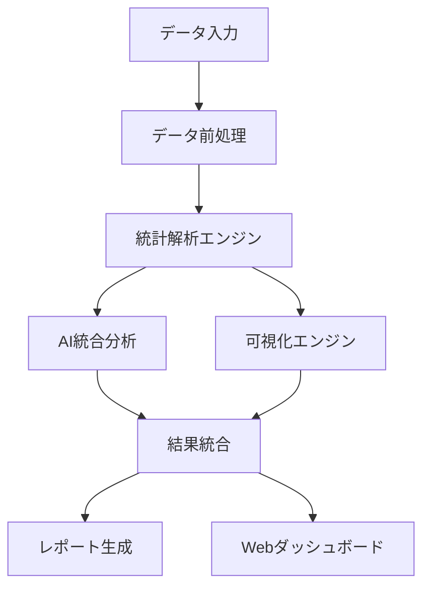

# Professional Statistics Suite - Architecture

## 📋 プロジェクト概要

Professional Statistics Suiteは、企業グレードの統計解析プラットフォームです。SPSSを超える高度な統計機能、AI統合、GPU加速を提供します。

## 🏗️ アーキテクチャ構成

### Core Modules (コアモジュール)

```
professional-statistics-suite/
├── 📊 Core Statistical Modules
│   ├── main.py                     # メインアプリケーション
│   ├── HAD_Statistics_GUI.py       # GUI インターフェース
│   ├── advanced_statistics.py     # 高度統計解析
│   ├── bayesian_analysis.py       # ベイズ統計
│   ├── survival_analysis.py       # 生存解析
│   └── config.py                  # 設定管理
│
├── 🤖 AI Integration
│   ├── ai_integration.py          # AI API統合
│   ├── ml_pipeline_automation.py  # AutoML パイプライン
│   └── data_preprocessing.py      # データ前処理
│
├── 📈 Visualization & Reporting
│   ├── advanced_visualization.py  # 高度な可視化
│   ├── professional_reports.py    # プロフェッショナルレポート
│   └── web_dashboard.py          # Webダッシュボード
│
├── 🔧 Utilities & Performance
│   ├── professional_utils.py      # ユーティリティ関数
│   ├── parallel_optimization.py   # 並列処理最適化
│   └── sample_data.py            # サンプルデータ
│
├── 🛡️ Security & Distribution
│   ├── booth_protection.py        # セキュリティ保護
│   └── booth_build_system.py      # ビルドシステム
│
├── 🧪 Testing & Development
│   ├── test_environment.py        # 環境テスト
│   └── test_ml_features.py        # ML機能テスト
│
└── 📁 Supporting Directories
    ├── _docs/                     # プロジェクトドキュメント
    ├── templates/                 # HTMLテンプレート
    ├── backup/                    # バックアップ
    ├── checkpoints/               # チェックポイント
    ├── logs/                      # ログファイル
    └── reports/                   # 生成レポート
```

## 🔄 データフロー


```mermaid
graph TB
    A[データ入力] --> B[データ前処理]
    B --> C[統計解析エンジン]
    C --> D[AI統合分析]
    C --> E[可視化エンジン]
    D --> F[結果統合]
    E --> F
    F --> G[レポート生成]
    F --> H[Webダッシュボード]
```

## 🚀 主要機能

### 1. 統計解析機能
- **基本統計**: 記述統計、推定、検定
- **高度統計**: 多変量解析、時系列解析
- **ベイズ統計**: MCMC、階層モデル
- **生存解析**: カプラン・マイヤー、Cox回帰
- **機械学習**: 教師あり・なし学習

### 2. AI統合機能
- **自然言語クエリ**: 日本語での解析指示
- **AutoML**: 自動機械学習パイプライン
- **AI API統合**: OpenAI、Google AI、Anthropic
- **画像解析**: OCR、データ抽出

### 3. 可視化・レポート
- **インタラクティブ可視化**: Plotly、Bokeh
- **統計グラフ**: Matplotlib、Seaborn
- **プロフェッショナルレポート**: PDF、HTML
- **Webダッシュボード**: リアルタイム分析

### 4. パフォーマンス最適化
- **GPU加速**: PyTorch、TensorFlow
- **並列処理**: マルチコア活用
- **メモリ最適化**: 大規模データ対応
- **キャッシュシステム**: 高速アクセス

## 🔧 技術スタック

### Frontend
- **GUI**: CustomTkinter、PyQt6
- **Web**: Streamlit、Dash、Flask
- **可視化**: Plotly、Bokeh、Matplotlib

### Backend
- **統計処理**: NumPy、SciPy、Statsmodels
- **機械学習**: Scikit-learn、XGBoost、LightGBM
- **AI統合**: OpenAI API、Google AI Studio、Anthropic
- **データ処理**: Pandas、Polars、PyArrow

### Infrastructure
- **データベース**: SQLAlchemy、PostgreSQL、MongoDB
- **キャッシュ**: メモリ最適化、チェックポイント
- **セキュリティ**: 暗号化、アクセス制御
- **配布**: PyInstaller、Docker対応

## 🎯 設計原則

### 1. モジュラー設計
- 各機能が独立したモジュール
- プラグイン形式での拡張可能
- 依存関係の最小化

### 2. スケーラビリティ
- 大規模データセット対応
- GPU並列処理活用
- 分散処理対応

### 3. ユーザビリティ
- 直感的なGUIインターフェース
- 自然言語での操作可能
- プロフェッショナルな出力

### 4. 信頼性
- 包括的なエラーハンドリング
- データ整合性保証
- 自動バックアップ機能

## 🔒 セキュリティ

### データ保護
- ローカル処理によるプライバシー保護
- 暗号化セッション管理
- アクセス制御システム
- 監査ログ記録

### コード保護
- ライセンス管理システム
- 不正使用防止機能
- セキュアな配布メカニズム

## 📊 パフォーマンス

### 最適化項目
- **GPU活用**: RTX 30/40/50シリーズ対応
- **並列処理**: CPU全コア活用
- **メモリ管理**: 効率的なデータ処理
- **I/O最適化**: 高速ファイル処理

### ベンチマーク目標
- **大規模データ**: 100万行以上の高速処理
- **リアルタイム**: 1秒以内の応答時間
- **メモリ効率**: 10GBデータを4GB RAMで処理
- **GPU加速**: CPU比10-100倍の高速化

## 🔮 将来計画

### 短期目標 (3ヶ月)
- クラウド分析対応
- 多言語UI対応
- 高度な可視化機能拡張

### 中期目標 (6ヶ月)
- 分散処理システム
- カスタムプラグイン開発
- エンタープライズ機能強化

### 長期目標 (1年)
- 完全自動統計解析
- AI統合の高度化
- グローバル展開対応

---

**🏗️ アーキテクト**: Professional Statistics Suite開発チーム  
**📅 最終更新**: 2025年1月27日  
**📖 バージョン**: v3.1+ 